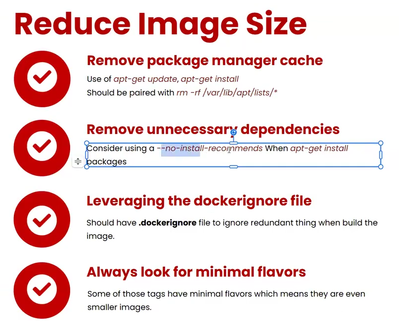
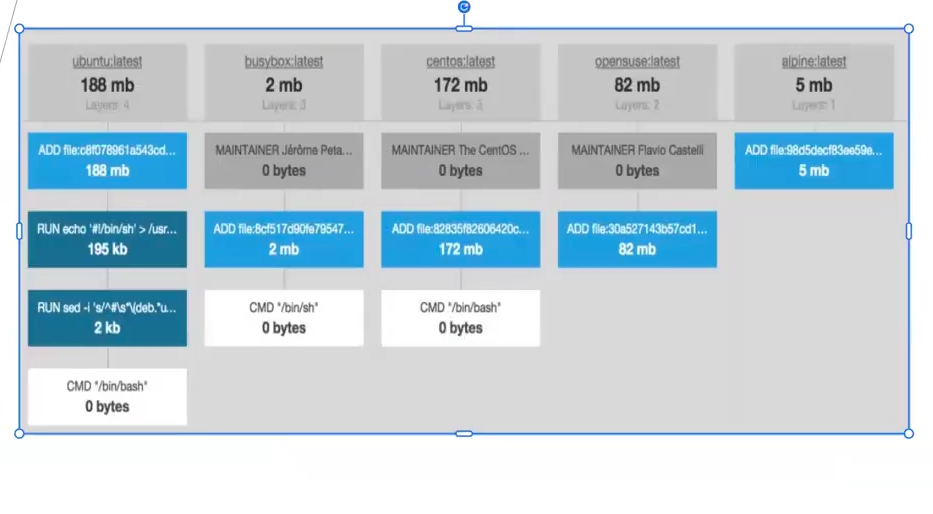
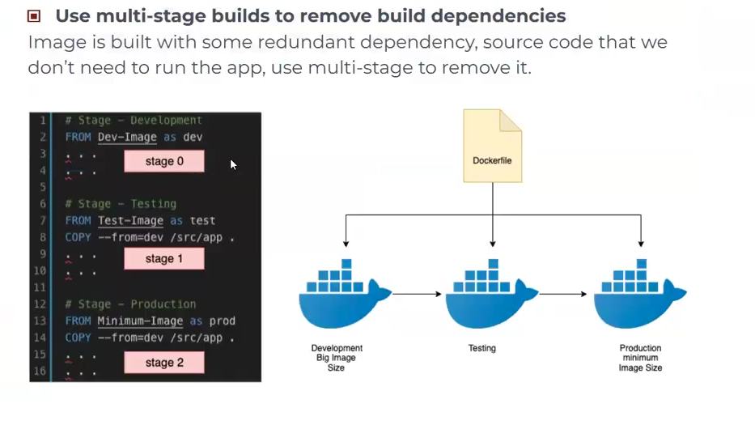
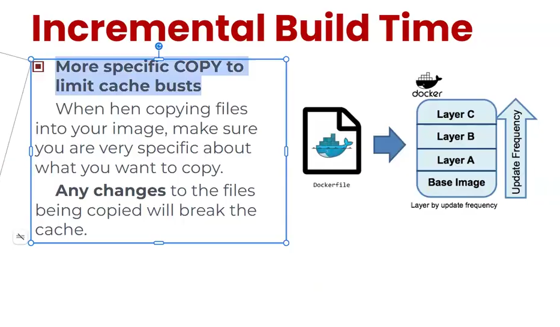

#

## Virtualization vs Containerization

- docker momentum 

## Docker - General information

- Docker object: Dockerfile ---build---> docker image ---run---> docker container
- Docker architecture: 
  - client
  - daemon 
  - registry

## Dockerfile  

```Dockerfile
# define the base image (tags, version) 
FROM  

LABEL

ENV

ARG

WORKDIR

# have to use flags -y ---> should know risks of this action
RUN 

#! COPY VS ADD
# copy file 
COPY

# add file from url 
ADD

# dev give it to devops
CMD

ENTRYPOINT

EXPOSE

VOLUME
```

## Docker CLI

- docker command  
- PUSH image to docker registry
  - create docker repo
  - rename for image tag
  - authenticate 
  - push image to registry

## Docker Production 

- docker compose
- docker swaarm
- kubernetes

## 

## TIP & TRICK 

**reduce image size**







<!-- NOTE -->

**build reactjs project**
npm i 
npm run dev

**build dotnet project**
sudo dnf install dotnet runtime 

