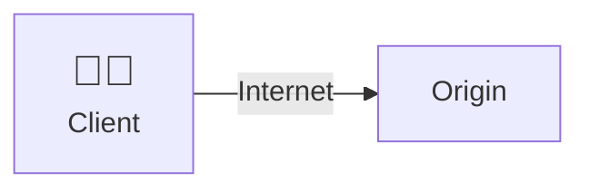
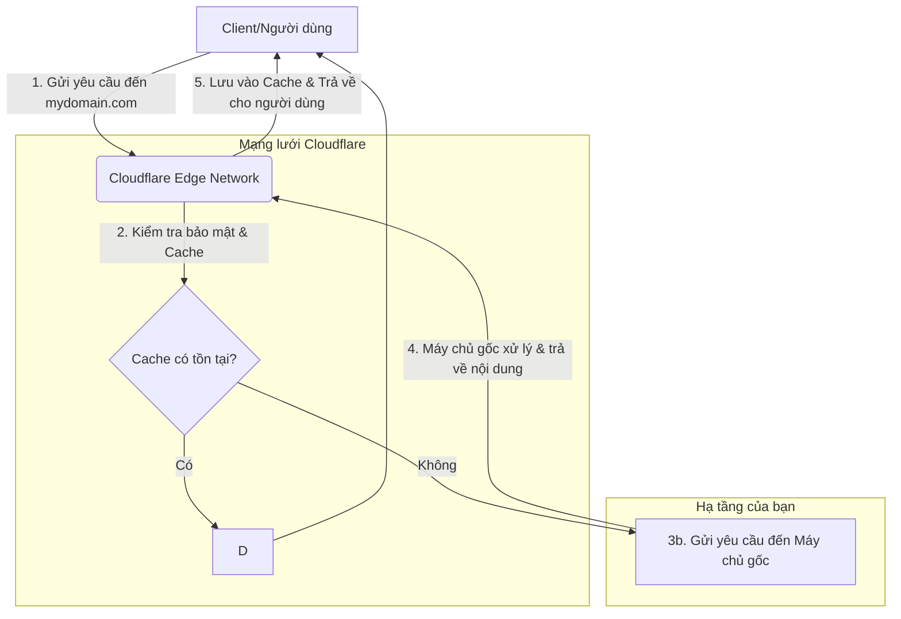

```mermaid
graph LR
    Client[<font size=5>👨‍💻</font><br>Client] -->|Internet| Origin;
```

```mermaid
graph LR
    Client[<font size=5>👨‍💻</font><br>Client] -->|Internet| Origin;
```

```mermaid
graph TD
    A[Client/Người dùng] -->|1. Gửi yêu cầu đến mydomain.com| B(Cloudflare Edge Network);
    B -->|2. Kiểm tra bảo mật & Cache| C{Cache có tồn tại?};
    C -->|Có| D;
    D --> A;
    C -->|Không| E[3b. Gửi yêu cầu đến Máy chủ gốc];
    E -->|4. Máy chủ gốc xử lý & trả về nội dung| B;
    B -->|5. Lưu vào Cache & Trả về cho người dùng| A;

    subgraph "Mạng lưới Cloudflare"
        B
        C
        D
    end

    subgraph "Hạ tầng của bạn"
        E
    end
```