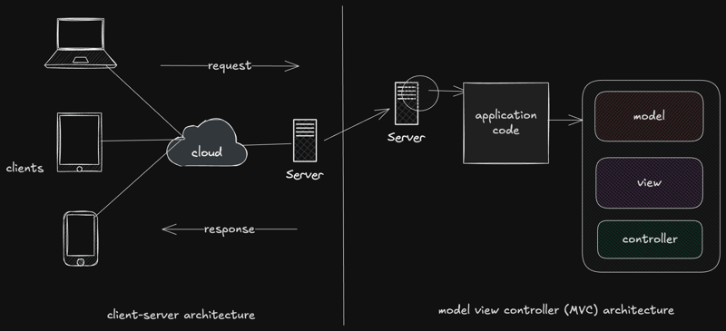
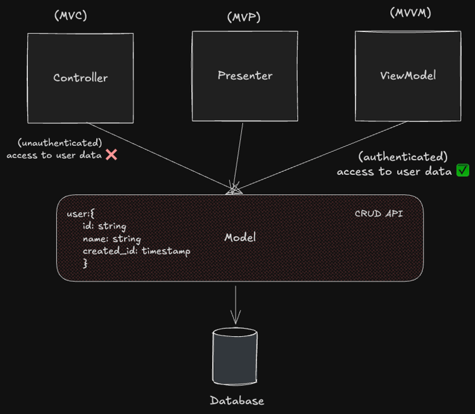
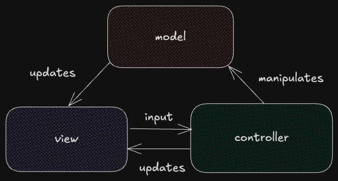
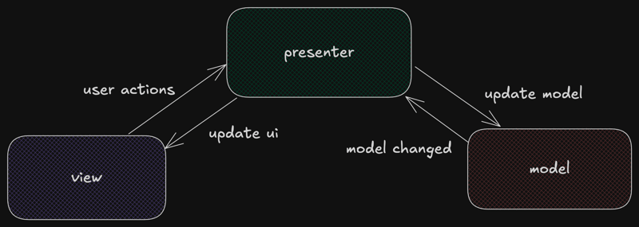
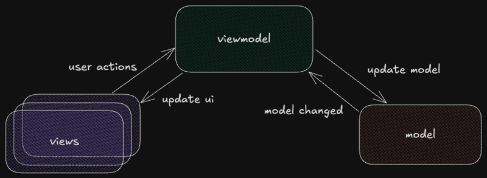

# Architecture patterns for begginers: MVC, MVP, and MVVM
Building software can be complex. We don't have to think much about it wien building side project, but production software differs. It can require multiple comp, all of which if not handled correctly can lead to chaos. But it doesn't need to be this complex. That why architectural patterns apear. 

## Architectural patterns 
Some top of architectural patterns in software design: client server, layered, monolithich, microkernel, even driven, etc. (These patterns are concerned with overall system architecture, including multiple applications, services, servers, etc)

However, MVP, MVC and MVVM focus on organizing code within a single app by separating data, UI, and logic. There are subset of architecture patterns that focus on the overall system.

## MVC, MVP, and MVVM
- Model View Controller
- Model View Presenter
- Model View ViewModel
All of them have 2 fixed comps: Model and View. Let's discuss them in detail 

### Model
The model consist of all the code that is related to data present in the software. Its main responsibilities include: 
1. Handle data and business logic
2. Encapsulate the app's data and the reles goverining access to that data
3. Handling data structures
4. Performing CRUD operations on data

### View
View is pretty much the front end of ur application or everything that the user will be able to see and interact with. Its reponsibilities include:
1. Handle non-business logic and purely presentational logic
2. Present the data provided by other layers to the user.
3. Receive user input and forward it to other layers.
4. (May) Communicate directly with the Model layer.

## MVC Architecture

MVC uses a Controller layer that communicates with bothe the Model and View layers. Its main reponsibilities of the controller include:
1. Manipulating data through the Model layer.
2. Receive instructions, aka the UI, from the View layer
3. Update the View with changes defined due to control logic

View can't directly interact with the Model but it can however receive updates based on chages in the data (by using Controller as the main comp to connect them)

## MVP Architecture

The Presenter layer is middle man between Model and View and handles all communication between them. There is no communication at all between the Model and View directly. It responsibilities include: 
1. Update the UI or the View layer based on user actions
2. Update the data or Model based on code logic
3. Handle much of the business logic that would be otherwise handled in the controller in MVC architecture

## MVVM Architecture

This architecture have something in common with MVP architecture. But it still have some key diff: 
1. Multiple views can be mapped to single ViewModel layer.
2. It  uses data binding between the ViewModel layer and the Vkiewlayer, making it more event driven
3. There is no concept of UI in this architecture. The View layer represents the actions of the user, not the interface

## Side by Side comparison
| Aspect                     | MVC                                 | MVP                                     | MVVM                                           |
| -------------------------- | ----------------------------------- | --------------------------------------- | ---------------------------------------------- |
| Full Name                  | Model-View-Controller               | Model-View-Presenter                    | Model-View-ViewModel                           |
| Separation of Concerns     | Basic                               | Better                                  | Best                                           |
| Data Flow                  | Two-way                             | One-way                                 | One-way with data binding                      |
| View-Logic Relationship    | Many-to-one                         | One-to-one                              | Many-to-one                                    |
| Testability                | Hard                                | Good                                    | Best                                           |
| Maintenance                | Hard                                | Easy                                    | Easy                                           |
| Learning Curve             | Easy                                | Easy                                    | Harder                                         |
| Performance                | Can be slower due to tight coupling | Better performance with looser coupling | Smooth performance, especially for complex UIs |
| UI Updates                 | Controller updates View             | Presenter updates View                  | ViewModel updates View through data binding    |
| Dependency on UI Framework | High                                | Low                                     | Low or no dependency                           |
| Scalability                | Suitable for small-scale projects   | Good for simple and complex projects    | Ideal for large, data-heavy apps               |

e.g. Companies using these diff architecture are: ...

The choice of architecture depend on fctors such as the complexity of the application, the dev tem's expertise, and requirements of the project

## Conclusion
This content is just about designing to how a single app can be divided into 3 comps for better management and scalability. There is no clear winner between them and each pattern offers unique advantages and suited to diff projects and dev scenarios.

Some ref maybe helpful:
1. [Android architecture pattern](https://www.geeksforgeeks.org/android-architecture-patterns/)
2. [Comparing software architecture patterns](https://www.masaischool.com/blog/comparing-software-architecture-patterns/)
3. [MVC, MVVM, and MVP](https://www.apptension.com/blog-posts/mvc-vs-mvvm-vs-mvp)

> Note: I only read and rewrite one article on dev.to. Click to this link to read full article: [Architecture pattern for begginer](https://dev.to/chiragagg5k/architecture-patterns-for-beginners-mvc-mvp-and-mvvm-2pe7)