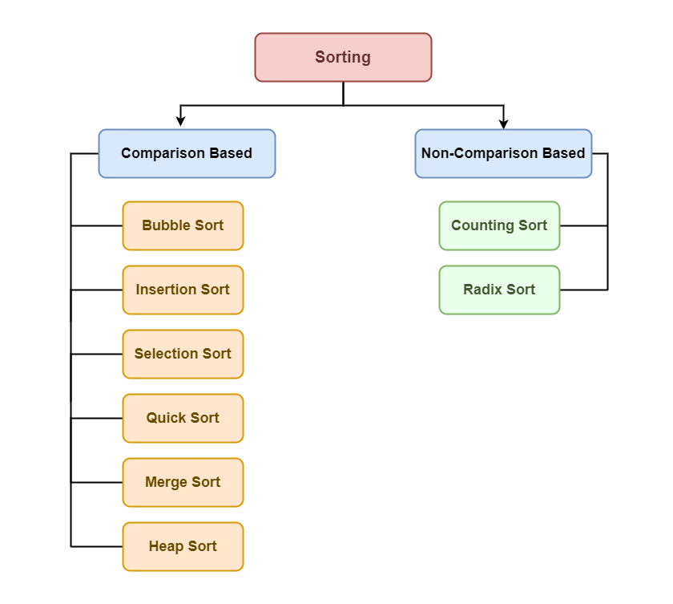
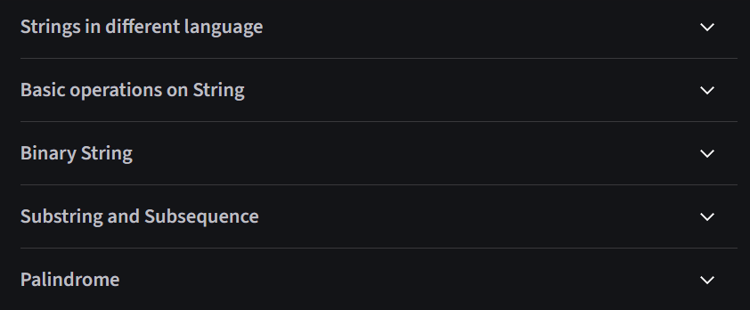

#  DATA STRUCTURES AND ALGORITHMS

# Complexities Analysis
## Basics
- Why is analysis of algo important?
- Order of growth: 
`c < loglog n < log n < n^1/2  < n < n Log n < n^2 < 2^n < n^n`
- Asymptotic analysis
- Worst, average and best case analysis of algo
## Big O Notation
`O(n!) > O(c^n) > O(n^c) > O(n.logn) > O(n) > O(logn) > O(1)`


# Array
- Definition: 
  - collection of items of the same var type
  - stored at contiguous memory locations

- Basic terminologies of Array
  - arr index
  - arr element
  - arr length

```js
// declaration of arr
let arr = []
// init arr
let arr = [1, 2, 3]
```

- Why do we need array? The idea of an array is to represent many instances in one variable.
- Types of arr: 
  - basic sized: fixed size arr, dynamic sized arr
  - basic dimensions: one-dimensional arr, multi-dimensional arr

## Operations on Array
```
1. array traversal
2. insertion 
3. deletion 
4. searching
  4.1. linear search
  4.2. binary search
```
## Applications of Array
```
**1. Application**
- Storing and accessing data ~ O(1)
- Searching ~ O(logn)
- Matrices: 2-D array
- Implementing other data structures: stacks, queues
- Dynamic programing
- Data buffers

**2. Advantages**
- Efficient and fast access
- Memory efficiency: store elemens in contiguous memory
- Versatility: can store many type of data
- Compatibility with hardware

**3. Disadvantages** 
- Fixed size
- Memory allocation issues
- Insertion and deletion challenges: requiers shifting subsequent elements
- Limited data type support: limiting use with complex data types
- Lack of flexibility: < liked lists, trees
```

# Searching Algo
## Linear Search ~ O(n)
## Binary Search ~ O(logn)

# Sorting Algo
## Intro
- Why sorting algo are important? reduces complexity of a problem → application: searching algo, data algo, divide and conquer methods, and dsa
  - print big dataset (want to arrange them)
  - data sorted, can get max-item, min-item ~ O(1) 
  - binary search 
 
- Sorting basics
  - In-place sorting
  - Internal sorting
  - External sorting
  - Stable sorting
  - Hybrid sorting
- Types of sorting techniques

- Some of the most common sorting algo: Selection sort, Bubble sort, Insertion Sort, Cycle Sort, Merge Sort, 3-way Merge Sort, Quick sort, Heap sort and Counting sort
- Some other: ([read more here](https://www.geeksforgeeks.org/dsa/introduction-to-sorting-algorithm/))

### Comparison of Complexity Analysis of Sorting Algorithms
| Sorting Algorithm         | Best Case    | Average Case | Worst Case   | Memory | Stable | Method Used           |
|---------------------------|--------------|--------------|--------------|--------|--------|------------------------|
| Quick Sort                | O(n log n)   | O(n log n)   | O(n²)        | log n  | No     | Partitioning          |
| Merge Sort                | O(n log n)   | O(n log n)   | O(n log n)   | n      | Yes    | Merging               |
| Heap Sort                 | O(n log n)   | O(n log n)   | O(n log n)   | 1      | No     | Selection             |
| Insertion Sort            | O(n)         | O(n²)        | O(n²)        | 1      | Yes    | Insertion             |
| Tim Sort                  | O(n)         | O(n log n)   | O(n log n)   | n      | Yes    | Insertion & Merging   |
| Selection Sort            | O(n²)        | O(n²)        | O(n²)        | 1      | No     | Selection             |
| Shell Sort                | O(n log n)   | O(n⁴⁄³)      | O(n³⁄²)      | 1      | No     | Insertion             |
| Bubble Sort               | O(n)         | O(n²)        | O(n²)        | 1      | Yes    | Exchanging            |
| Tree Sort                 | O(n log n)   | O(n log n)   | O(n log n)   | n      | Yes    | Insertion             |
| Cycle Sort                | O(n²)        | O(n²)        | O(n²)        | 1      | No     | Selection             |
| Strand Sort               | O(n)         | O(n²)        | O(n²)        | n      | Yes    | Selection             |
| Cocktail Shaker Sort      | O(n)         | O(n²)        | O(n²)        | 1      | Yes    | Exchanging            |
| Comb Sort                 | O(n log n)   | O(n²)        | O(n²)        | 1      | No     | Exchanging            |
| Gnome Sort                | O(n)         | O(n²)        | O(n²)        | 1      | Yes    | Exchanging            |
| Odd–even Sort             | O(n)         | O(n²)        | O(n²)        | 1      | Yes    | Exchanging            |

## Application
```
**1. Application**
- Quick finding k-th smallest or largest: ~ O(1)
- Searching algo: binary search, ternary search 
- Data management: sorted data → ez to search, retrieve, analyze
- Database optimization: improvees query performance 
- Machine learning: prepare data for training models
- Data analysis
- Operating system 

**2. Advantages**
- Efficiency: easier and faster to search, retrieve, and analyze info
- Improved performance: algo↑ → performance↑ 
- Simplified data analysis
- Reduced memory consumption
- Improved data visualization

**3. Disadvantages**
- Insertion
- Algo selection
- For some problems, hasing > sorting
```
## Sorting Algo (~detail)

# Hashing
This is a technique that efficiently stores and retrieves data for quick access
  - using **hash func** for mapping data to index in hash table → fast retrive info based on key
  - achieve 3 operations (search, insert, delete) ~ O(1)
  - distinct items(keys) and dictionaries (key value pairs)

## Intro
### General
- 3 operations (search, insert, del) ~ O(1) → better than arr, linked list
- app: dictionaries, frequency counting, maintaining data
- Situation where hash is not used?
  - when data needs to be sorted for operation (search, insert, del) → using **BST**
  - when keys are strings and need prefix op (like autocomplete or dictionary lookups) → using a **trie** 
  - when op (like floor and ceiling) are required → using **BST**
→ if ur app depends on the **order of elements** or involves **string manipulation** → hash table is NOT the optimal solution

- Component of Hashing: key, hash func, hash table
- How does hashing work? b/c `key ---hash-func---> index(in-hash-table)` 
  → ez to find location that value be stored in
  → good to store (key, value) pair
- What is hash func? 
- **Collision** in hashing? conflix when many keys **have same hash value** (read more: [collision techniques](https://www.geeksforgeeks.org/dsa/collision-resolution-techniques/))
- **Load Factor** in hashing? `Load Factor = Total elements in hash table/ Size of hash table`
- **Rehashing**? the load factor > predefinded value → hashs again AND stores value in the new hash table

## Applications 
```
Hashing is a powerful technique that enables search, insert, and delete operations in average constant time (~ O(1)).
**1. Common use cases:**
- Database indexing: data retrieval↑
- Dictionaries: word lookup↑
- Password storage: store hashed passwords (NOT plain text)
- Network routing: determines *optimal paths* for data packets
- Bloom Filters: appications in spam filtering, recommendation sys
- Cryptography: digital signatures, MACs, key derivation functions
- Load balancing: distributes network requests (~via consistent hashing)
- Blockchain
- Image processing
- File comparison: verifies file integrity (e.g: MD5, SHA-1)
- Fraud detection: detects malicious activity in cybersecurity tools.
- Caching
- Symbol tables
- Associative arrays: fast key-based lookup (in SQL)

**2. More specialized applications:**
- Message Digest: using hash func (like SHA-256) → verifies the integrity 
- Password Verification
- Data Structures: HashMap, dict, uncordered_map
- Compiler Operations
- Rabin-Karp Algorithm
- Mapping file name to path: `file_name → file_path`
- Graphics
```

## Separate Chaining 
This is `collision handling technique`. Multiple keys have same hash value → be stored in linked list(/dynamic arr) at same index of table.

**Advantages**
- ez to implement 
- hash table NEVER fill up 
- less depend on hash func or load factor
- good when **number of key**, **frequency of key insert(del)** is **unknown**

**Disadvantages**
- cache performance↓ (b/c using linked list)
- some slot in hash table **unused** → memory waste
- **chain(~too long)** → search time **~O(n)**
- extra memory for storing links

**Performance**
- Load factor: lf = `no of keys / no slots in table`
- Search/Del ~ O(lf)
- Insert ~ O(1)

**Data Structures for Chains**
Below are the common data structures used to store chains in separate chaining:
| Structure              | Search      | Delete      | Insert      | Cache Friendly |
| ---------------------- | ----------- | ----------- | ----------- | -------------- |
| **Linked List**        | O(len)      | O(len)      | O(1)        | NO             |
| **Dynamic Array**      | O(len)      | O(len)      | O(1)*       | OK             |
| **Self-Balancing BST** | O(log(len)) | O(log(len)) | O(log(len)) | NO             |
> *Insert in dynamic arrays is generally O(1), unless resizing occurs.

## Open Addressing (or Closed Hashing)
It is `collision resolution technique`. All elements are stored directly inside the table itself. When collision occurs → look for the next available slot (probing)

**Basic Operations**
- Insert(k)
- Search(k)
- Delete(k): NOT deleteing → mark as 'deleted' (search logic: unaffected)

**Probing Methods**
```
**1. Linear Probing**
- Checks the next sequential slot: `(hash(x) + i) % tableSize`
- adv: simple, cache friendly
- dis: clustering 

**2. Quadratic Probing **
- Checks increasingly spaced slots: `(hash(x) + i²) % tableSize`
- adv: reduce clustering (< linear probing)
- dis: might skip over some slots

**3. Double Hashing**
- Uses a second hash function: (hash1(x) + i × hash2(x)) % tableSize
- adv: spreads keys and avoids clustering 
- dis: cache↓, computation cost↑
```
**Comparison Between Separate Chaining and Open Addressing**
| No. | Criteria                                | Separate Chaining                                      | Open Addressing                                             |
|-----|------------------------------------------|--------------------------------------------------------|-------------------------------------------------------------|
| 1   | Implementation Complexity                | Simpler to implement                                   | Requires more computation                                   |
| 2   | Table Capacity                           | Hash table never fills up — chains can grow indefinitely | Table may become full                                       |
| 3   | Sensitivity to Hash Function             | Less sensitive                                         | More sensitive to clustering and load factor               |
| 4   | Suitability Based on Key Frequency       | Good when key frequency is unknown                    | Best when key frequency and volume are known               |
| 5   | Cache Performance                        | Poor (keys stored via linked list)                    | Better (data stored within one array)                      |
| 6   | Space Utilization                        | May waste space (some slots never used)               | Utilizes all slots regardless of hash matches              |
| 7   | Extra Memory Usage                       | Requires extra space for links                        | No additional memory for links                             |
> **Note:** Chaining suffers from poor cache performance because linked lists require memory jumps, making it harder for the CPU to predict and cache access. Open addressing benefits from contiguous memory access.

**Performance of Open Addressing**
- Load factor: `lf = no-of-keys/ table-size`
- Expected time (search, insert, del): O\left(\frac{1}{1 - \alpha}\right)
> **Note**: lf approaches 1 → performance↓

# Two Pointer Technique

# Window Sliding Techique

# Prefix Sum Technique

# String
## Intro 
- It is a sequence of characters. In languages(Java, Python, JS), strings are generally **immutable**
- Strings are stored in contiguous memory blocks like arrays.

**Common String Operation**
- string length
- character search
- substring check
- insert char
- del char
- string equality 
- string cancatenation
- string reversal
- string rotation
- palindrome check

## Applications
```
**1. Applications**
**Common Applications**
- Plagiarism Detection
- Encoding/Decoding (Ciphering)
- Information Retrieval
- Approximate Suffix-Prefix Overlap
- Network Communication
- File Handling
- Text Analysis

**Real-time Applications**
- Spam Filtering
- Bioinformatics
- Intrusion Detection
- Search Engines

**2. Advantages**
- Text Processing: search, format, replace, manipulate text ez.
- Data Representation: encode (numbers, dates, times) as strings.
- Ease of Use: simple syntax
- Cross-Language Support
- Memory Efficient: ez allocation

**3. Disadvantages**
- High Memory Consumption: with large strings.
- Immutability: leading to overhead.
- Performance Bottlenecks: slower than another data structures
- Encoding/Decoding Issues: encodings can be complex.
- Security Risks: vulnerable to injection attacks or buffer overflows if misused
```

## Subsequence and Substring
**Substring**
- A substring is a part of a string consisting of contiguous characters.
- For a string of length n, the number of non-empty subsequences is: `\frac{n(n+1)}{2}` 

**Subsequence**
- A subsequence is a sequence that can be formed from the original string by removing zero or more characters while preserving the original order.
- For a string of length n, the number of non-empty subsequences is: `2^n - 1`

**Key diff**
- Substring → characters must be **adjacent**
- Subsequence → characters can be **non-adjacent**, but must maintain **original order**

## Some sus content about String

> Can see that sus shit on the bottom at Geek4geek
> Click → [here](https://www.geeksforgeeks.org/dsa/introduction-to-strings-data-structure-and-algorithm-tutorials/) ← to start getting headaches x.x

# Recursion
# Matrix/Grid

# Linked List
**Comparison: Linked List vs Array**
| Feature             | Linked List                                | Array                                     |
|---------------------|---------------------------------------------|-------------------------------------------|
| Data Structure       | Non-contiguous                             | Contiguous                                 |
| Memory Allocation    | Allocated one by one per element           | Allocated as a block for entire array      |
| Insertion/Deletion   | Efficient (constant time at ends)          | Inefficient (may require shifting)         |
| Access               | Sequential (must traverse from head)       | Random (direct index access possible)      |
> Both structures are used to implement abstract data types like stacks, queues, and deques, but they differ significantly in performance and memory behavior.

## Single Linked List
It i a basic data structure consisting of nodes. Each node has 2 comps: 
- Data: Store value
- Pointer: References the next node in the sequence 
~ final node has a pointer set to `null`(end of the list)

```cpp
struct Node{
  int data;
  Node* next;
  Node(int data){
    this->data = data;
    this->next = nullptr;
  }
};
```

### Common Operations
```
1. Traversal
- init pointer at head
- loop while pointer is not null
-  process data and move to next node

2. Searching 
- start at head → compare data of each node
- return true if found; else continue.
- return false if not found

3. Length 
- set counter to 0
- traverse the list, incrementing for each node
- return counter when traversal ends

4. insertion 
4.1. at beginning: create new node, points its next to current head, update head to the new node
4.2. at end: create new node, traverse to last node, set current last node's next to  new node
4.3. at specific pos: traverse to the target pos → insert by updating next pointer (validate pos before insertion)

5. deletion
5.1. at beginning: check if list is empty, mode head to second node,delete original head node
5.2. at end: traverse to second-last node, set its next to null, delete the last node
5.3. at specific pos: validate pos, traverse to node before target, update pointer to bypass the node, delete the target node

6. modification: traverse to the desired pos → validate bounds → update the node's data fielde

7. reversal: use 3 pointer (~prev, cur, next), reverse links bewwen nodes, after traversal update head to the las node(prev)
```

## Doubly Linked List
It is data structures where each node contains:
- data field
- a pointer to the next node
- a pointer to the previous node
This allows traversal in both forward and backward directions, and supports efficient insertion and deletion.

```cpp
struct Node {
    int data;
    Node* prev;     
    Node* next;     

    Node(int d) {
        data = d;
        prev = next = nullptr;
    }
};
```

### Operations
```
**1. Traversal**
Forward Traversal:
- Start from head
- While current is not NULL:
- Process data
- Move to current->next
Backward Traversal (Optional):
- Start from tail
- While current is not NULL:
- Process data
- Move to current->prev

**2. Finding Length**
- Initialize counter to 0
- Start from head node
- Traverse using next pointers
- Increment counter for each node
- Return final count

**3. Insertion**
3.1. At Beginning
- Create a new node
- Set newNode->next = head
- If head exists, set head->prev = newNode
- Update head = newNode

3.2. At End
- Create a new node
- If list is empty, set head = newNode
- Else, traverse to tail
- Set tail->next = newNode
- Set newNode->prev = tail

3.3. At Specific Position
- Traverse to target position
- Link newNode between previous and next nodes
- Update surrounding pointers accordingly

**4. Deletion**
4.1. At Beginning
- If list is empty, return
- Store head in temp
- Move head to head->next
- If head exists, set head->prev = NULL
- Delete temp

4.2. At End
- Traverse to last node
- Update second-last->next = NULL
- Delete last node

4.3. At Specific Position
- Traverse to node to be deleted
- Update previous->next and next->prev to skip the node
- Delete the node
```

### Applications
```
1. Advantages
- Bi-directional traversal
- Easier insertion/deletion
- Useful in implementing stacks, queues, deques

2. Disadvantages
- More complex structure
- Higher memory usage (extra pointers)

3. Applications
- Undo/redo functionality in editors
- Browser history navigation
- Playlist management in music apps
- Caching systems
- Implementing deque (double-ended queue)
```

## Circular Linked List
A **circular linked list** is a data structure where the last node links back to the first, forming a loop. This structure enables uninterrupted traversal and is especially useful for tasks like scheduling and playlist management.

**What is circular linked list?** In a circular linked list, all nodes are connected in a circle. Unlike traditional linked lists, which end with a `NULL` reference, the last node in a circular list points back to the first node. This allows continuous navigation through the list.

### Types of Circular Linked Lists

There are two main types based on the kind of linked list used:
**Circular Singly Linked List**
- Each node contains a single pointer called `next`.
- The `next` of the last node points to the first node.
- Traversal is possible in only one direction.

**Circular Doubly Linked List**
- Each node contains two pointers: `next` and `prev`.
- The `next` pointer connects to the next node; `prev` connects to the previous node.
- The last node points back to the first, and the first points to the last.
- Allows bidirectional traversal.

**Node Structure in C++**
```cpp
struct Node {
    int data;
    Node* next;

    Node(int value) {
        data = value;
        next = nullptr;
    }
};
```
**Why Use a Pointer to the Last Node?**
Using a pointer to the last node improves efficiency:
- **Insertion at the beginning and insertion at the end** can both be done in constant time (~O(1)).
- This **avoids** the need to **traverse the entire list** for each insertion.

### Applications
```
# Circular Linked List: Advantages, Disadvantages, and Applications
**1. Advantages**
- No null references
- Traversal flexibility: You can begin traversing from any node and loop back to it without restarting from the head.
- Efficient for circular tasks: Ideal for implementing circular queues, scheduling systems, or playlists where looping is necessary.
- Memory-efficient: Although there's no direct reference to the previous node (as in doubly linked lists), the previous node can still be identified by traversal if needed.

**2. Disadvantages**
- More complex implementation: > single linked list
- Risk of infinite loops
- Difficult debugging

**3. Applications**
- Round-Robin scheduling
- Multiplayer games
- Buffer systems: Common in streaming platforms where data is continuously produced and consumed.
- Media players: Allows playlists to cycle through songs endlessly.
- Browser history caches: Supports efficient backward navigation
```
### Operations
```
**1. Insertion**
**1.1. Insertion into an Empty List**
- Create a new node.
- Point its `next` to itself to form a loop.
- Update the `last` pointer to this new node.

**1.2. Insertion at the Beginning**
- Create a new node.
- If the list is empty, let it point to itself.
- Otherwise, set its `next` to the current head (`last->next`).
- Update `last->next` to the new node, ensuring the circular structure remains intact.

**1.3. Insertion at the End**
- If the list is empty, the new node points to itself.
- Otherwise:
  - Set `last->next` to the new node.
  - Make the new node’s `next` point to the head.
  - Update `last` to the new node.

**1.4. Insertion at a Specific Position**
- Validate position:
  - If the list is empty and position ≠ 1: invalid.
  - For valid positions:
    - Traverse to the desired location.
    - Adjust `next` pointers to insert the new node.
    - If added after the last node, update `last`.

-----

**2. Deletion**
**2.1. Delete the First Node**
- **Empty list**: Output message and return `nullptr`.
- **Only one node**: Delete and set `last = nullptr`.
- **Multiple nodes**: Update `last->next` to skip head and delete original head.

**2.2. Delete a Specific Node**
- Handle empty list and single node edge cases.
- Traverse with two pointers (prev and curr) to find the target.
- If found:
  + Update prev->next to skip curr
  + Delete curr
  + Update last if deleting the tail.
- If not found, display appropriate message.

2.3.Delete the Last Node
- Empty list: Return nullptr.
- Single node: Delete and return nullptr.
- Multiple nodes:
  + Traverse to find second-to-last node.
  + Update its next pointer to head.
  + Delete the tail node and update last.

----

**3. Searching**
Searching is similar to traditional lists but requires circular-aware traversal:
- Start from any node (commonly last->next)
- Loop until:
  + Value is found
  + You return to the start node (to avoid infinite loop)
- Use conditional checks and breaks to control flow.
```

## Linked List vs Array Comparision
| Feature                     | Array                       | Linked List                    |
| --------------------------- | --------------------------- | ------------------------------ |
| Memory Structure            | Contiguous                  | Non-contiguous                 |
| Random Access               | O(1)                        | O(n)                           |
| Insertion/Deletion (Middle) | O(n)                        | O(1) (with pointer)            |
| Cache Friendly              | Yes                         | No                             |
| Space Flexibility           | Fixed/Resized allocations   | Dynamic as needed              |
| Use in Queue/Deque          | Complex (circular logic)    | Simple and direct              |
| Overhead                    | Minimal (no extra pointers) | Requires pointer for each node |

# Stack
A **stack** is a linear data structure that follows the **LIFO (Last In, First Out)** principle: the last item added is the first one removed. Both insertion and deletion happen at the **top** end of the stack.

## Intro To Stack
**Stack Representation**
Stack operates in LIFO order:
- `push()` inserts at the top
- `pop()` removes from the top

### Types of Stack
**Fixed Size Stack**
- Stack has a predefined capacity.
- Overflow error when trying to add beyond capacity.
- Underflow error when removing from an empty stack.

**Dynamic Size Stack**
- Grows and shrinks automatically.
- Often implemented using a **linked list**.
- More flexible for dynamic data requirements.

### Basic Operations
| Operation   | Description                                   |
|-------------|-----------------------------------------------|
| `push()`    | Insert an element at the top                 |
| `pop()`     | Remove the top element                       |
| `top()`     | View the top element without removing        |
| `isEmpty()` | Check if stack is empty                      |
| `isFull()`  | Check if stack is full (relevant to fixed size) |

### Algorithms Explained
```plaintext
**1. Push Operation**
If (top == capacity - 1):
  Stack Overflow
Else:
  top = top + 1
  stack[top] = value

**2. Pop Operation**
If (top == -1):
  Stack Underflow
Else:
  value = stack[top]
  top = top - 1
**3. Top/Peek Operation**
If (top == -1):
  Stack is empty
Else:
  return stack[top]
  
4. isEmpty: return (top == -1)

5. isFull: return (top == capacity - 1)
```

**Complexity Analysis**
push(), pop(), top(), isEmpty(), isFull(): ~ O(1)	

## Stack Array Implementation
Stacks are linear data structures that follow the **LIFO (Last In First Out)** principle. The last element inserted is the first to be removed. This implementation uses an array, treating its **end (last element of arr) as the top of the stack**
### Implementation Steps
1. Initialize an array to represent the stack.
2. Use the end of the array as the stack’s top.
3. Implement these core operations:
   - `push`: insert at the top
   - `pop`: remove from the top
   - `peek`: view the top item
   - `isEmpty`: check if the stack is empty
   - `isFull`: check if the stack is full
  
### Stack Operations
```
**Push**
- Checks if the stack is full.
- On success, adds the element at the top.
- If full, triggers an **overflow** error.

**Pop**
- Checks if the stack is empty.
- On success, removes and returns the top element.
- If empty, triggers an **underflow** error.

**Peek / Top**
- Returns the current top element without removing it.
- If empty, reports “Stack is empty.”

**isEmpty**
- Returns `true` if `top == -1`.

**isFull**
- Returns `true` if `top == capacity - 1`.
```
**Complexity Analysis of All Operations**
- Time complexity: O(1)
- Space complexity: O(n)

### Implementations
**Fixed-Sized Array**
- Stack size is defined during creation.
- Fast and efficient when element count is predictable.

**Dynamic-Sized Array**
- Uses structures like `vector`, `ArrayList`, `list`, etc.
- Automatically resizes as elements are added or removed.
- May incur performance costs during resizing.

**Comparison**
| Aspect              | Fixed-Sized Array    | Dynamic-Sized Array        |
|---------------------|----------------------|-----------------------------|
| Size flexibility     | No                | Yes                      |
| Performance (avg)    | O(1)              |  O(1) amortized           |
| Memory efficiency    | High              | May need reallocation    |
| Ease of use          | Simple            | Very simple              |
| Worst-case behavior  | Predictable        | May vary with resizing   |

### Advantages of Array-Based Stack
- Easy to implement.
- Fast access using indexing.
- Memory-efficient (no pointers needed).

### Disadvantages
- Fixed size (in static implementation).
- Not suitable for highly dynamic usage unless using dynamic arrays.
- Can incur resizing overhead in dynamic versions.

## Stack Linked List Implementation
This implementation uses a **singly linked list**, where each node contains data and a link to the next node.

**Structure Overview**
- The **`top` pointer** (or `head`) always points to the most recent element.
- All operations—`push`, `pop`, and `peek`—are done via the top node.
- Stack grows or shrinks dynamically as new nodes are added or removed.

### Stack Operations
`push(data)`
- Creates a new node with the given value.
- Links new node to current `top`.
- Updates `top` to point to this new node.

`pop()`
- Checks if stack is empty.
- Removes `top` node and updates `top` to the next node.

`peek()`
- Returns the data value at the `top` node.
- If stack is empty, returns a message indicating that.

`display()`
- Iterates from `top` to the end (`NULL`) and prints values sequentially.

**Complexity Analysis of All Operations**
- Time complexity: O(1)
- Space complexity: O(n)

### Benefits of Linked List Implementation
- Dynamic Memory Allocation: Stack grows/shrinks as needed without fixed capacity.
- Efficient Memory Usage: Uses less space compared to doubly linked list.
- Straightforward Code: Simple implementation with minimal code.
- Versatile: Can be used to build other data structures like queues or trees.

### Real-World Applications of Stacks
- Function Call Stack: Manages return addresses during function execution.
- Undo/Redo Operations: Tracks user actions in editors.
- Browser History Navigation: Back/forward operations use stack logic.
- Expression Evaluation: Used in compilers for parsing and evaluating expressions.
- Recursive Function Handling: Each call is pushed onto the stack until base condition is met.

## Stack Implementation using Deque
A **deque (double-ended queue)** is a linear data structure that allows insertion and deletion at both ends. This flexibility makes it an ideal choice for implementing a **stack**, which requires insertion and deletion from **only one end**—following the **LIFO (Last In First Out)** principle.

**Why Use Deque for Stack?**
- In stack operations, both `push` and `pop` occur at the same end.
- A deque supports **O(1)** time complexity for both insertions and deletions at **front** and **back**.
- To simulate stack behavior, we use **one end** of the deque—typically the **back** (also called **rear**).

**Preferred Usage by Language** ~ Java, Python

**Benefits of Using Deque for Stack**
- **Efficient operations**: All key stack methods (`push`, `pop`, `peek`) are optimized.
- **Simple syntax and reliable performance** across programming languages.
- **Avoids limitations** of fixed-size arrays or legacy stack implementations.

## Applications of Stack

### Application
- **Function Calls**  
  Tracks return addresses for nested function executions, allowing the program to resume correctly after each call.

- **Recursion**  
  Stores local variables and return addresses of recursive functions.

- **Expression Evaluation**  
  Used to evaluate expressions in postfix notation (Reverse Polish Notation).

- **Syntax Parsing**  
  Validates syntax structure in programming languages and compilers.

- **Memory Management**  
  Helps manage memory allocation and deallocation in operating systems and some languages.

- **Algorithmic Problems**  
  Efficiently solves problems like:
  - Next Greater / Smaller Element  
  - Previous Greater / Smaller Element  
  - Largest Rectangle in Histogram  
  - Stock Span Problem

### Advantages of Stack
| Feature                    | Benefit                                  |
|---------------------------|------------------------------------------|
| **Simplicity**            | Easy to understand and implement         |
| **Efficiency**            | `push` and `pop` operations are O(1)     |
| **LIFO Nature**           | Ideal for managing nested operations     |
| **Memory Efficiency**     | Stores only active elements              |

### Disadvantages of Stack
| Limitation                 | Description                             |
|---------------------------|-----------------------------------------|
| **Limited Access**        | Can only access the top element         |
| **Potential Overflow**    | Exceeding capacity causes data loss     |
| **No Random Access**      | Not suitable for ordered element access |
| **Fixed Capacity**        | Size must be known or dynamically managed|

# Queue
## Intro
A **queue** is a linear data structure that follows the **FIFO (First In, First Out)** principle. The first element inserted is the first to be removed or processed. It's like a line of customers waiting for service—first come, first served.

**FIFO Principle**
- The **front** of the queue holds the element to be removed next.
- The **rear** of the queue is where new elements are added.
- Queue operates just like a ticket line, maintaining fairness through order.

**Key Terminologies**
| Term       | Description                                                              |
|------------|---------------------------------------------------------------------------|
| `Front`    | Element next in line to be removed (head of the queue)                   |
| `Rear`     | Most recently added element (tail of the queue)                          |
| `Size`     | Current number of elements in the queue                                  |
| `Capacity` | Maximum number of elements the queue can hold                            |

**Core Operations** ~ Time Complexity O(1)
| Operation     | Description                                                  |
|---------------|--------------------------------------------------------------|
| `enqueue()`   | Adds an element at the rear                                  |
| `dequeue()`   | Removes an element from the front                            |
| `peek()`      | Returns the front element without removing it                |
| `size()`      | Returns the number of elements in the queue                  |
| `isEmpty()`   | Returns `true` if queue is empty                             |
| `isFull()`    | Returns `true` if queue is full                              |

**Implementation Methods**
- Simple Array Implementation
- Circular Array Implementation (for improved efficiency)
- Linked List Implementation

**Type of Queue**
1. Simple Queue
- Follows basic FIFO logic.
- Insert at rear, remove from front.
2. Double-Ended Queue (Deque)
- Supports insertion and deletion from both ends.
- Input Restricted Queue
  - Insert at one end only
  - Remove from both ends.
- Output Restricted Queue
  - Insert at both ends.
  - Remove from one end only.
3. Priority Queue
- Elements are processed based on priority values.
- Ascending Priority Queue: Smaller priority values are processed first.
- Descending Priority Queue: Larger priority values are processed first.

**Applications of Queue**
- **Operating Systems**: Task scheduling, printer queues, disk access management.
- **Producer-Consumer Scenarios**: Queues buffer data between slow producer and fast consumer.
- **Networking**: Queues are used in routers, switches, and mail servers.
- **Algorithms**: Widely used in BFS (Breadth First Search), Topological Sorting, etc.

## Basic Operations for Queue Data Structure
### Core Queue Operations
| Operation     | Description                                                  |
|---------------|--------------------------------------------------------------|
| `enqueue(data)`   | Inserts an element at the rear end of the queue          |
| `dequeue()`       | Removes the front element from the queue                 |
| `getFront()`      | Retrieves (without removing) the element at the front    |
| `getRear()`       | Retrieves (without removing) the element at the rear     |
| `isEmpty()`       | Returns `true` if queue is empty, else `false`           |
| `isFull()`        | Returns `true` if queue is full (if fixed capacity)      |
| `size()`          | Returns the total number of elements in the queue        |

### **How Each Operation Works**
- `enqueue(data)`
  - Check if queue is full.
  - If yes → report **overflow**.
  - If not:
    - Move `rear` pointer forward.
    - Insert `data` at `rear` position.

- `dequeue()`
  - Check if queue is empty.
  - If yes → report **underflow**.
  - If not:
    - Access element at `front`.
    - Move `front` pointer forward.

- `getFront()`
  - If queue is empty → return `-1`.
  - Else → return element at `front`.
  
- `getRear()`
  - If queue is empty → return `-1`.
  - Else → return element at `rear`.

- `isEmpty()`: Return `true` if `len(queue) == 0`.

- `size()`: Return `len(queue)` — number of elements currently in the queue.

##  Array Implementation of Queue
**Key Concepts**
- **Insertion (enqueue)** happens at the **rear** of the queue.
- **Deletion (dequeue)** happens from the **front** of the queue.
- The main distinction from a stack is that the **oldest** item is removed first, whereas a stack removes the **newest**.

### Simple Array Implementation
- **Tracking Variables**: `front` and `size`, with `rear = front + size - 1`.
- **Enqueue**:
  - Insert at the end (`rear`).
  - Time Complexity: **O(1)**
- **Dequeue**:
  - Remove from the beginning (`front`).
  - All other elements must shift one position forward.
  - Time Complexity: **O(n)**
- **All operations (exept Dequeue) ~ O(1)**

### Circular Array Implementation
**Key Idea**
- **Wrap around** the array using modulo arithmetic.
- **Insert**: Move rear forward using `(rear + 1) % capacity`
- **Delete**: Move front forward using `(front + 1) % capacity`

**Complexity of All Operation** ~ **O(1)**

## Linked List Implementation
**Core Concepts**
- **`front`** points to the first node in the queue.
- **`rear`** points to the last node in the queue.
- Each operation updates one or both pointers depending on whether the queue is empty or active.
### Operations Decription
1. `enqueue(x)` – Insert Element
- Creates a new node with value `x`.
- If the queue is empty:
  - Set both `front` and `rear` to the new node.
- Otherwise:
  - Set `rear.next` to the new node.
  - Move `rear` to the new node.

2. `dequeue()` – Remove Element
- If the queue is empty:
  - Do nothing or return error.
- Otherwise:
  - Move `front` to `front.next`.
  - If `front` becomes `None`, set `rear` to `None`.

3. `isEmpty()` – Check Empty
- Returns `True` if `front` is `None`.

4. `printQueue()` – Display Queue Contents
- Traverse from `front` to the end.
- Print data from each node.
- If queue is empty, print "Queue is empty".

**Complexity Analysis**: All operations work in constant time by updating pointers only—no traversal required. ~ **O(1)**

## Application 
A **Queue** is a linear data structure that follows the **FIFO (First In First Out)** principle. The first element added is the first to be removed. Insertion occurs at the **rear end**, and deletion occurs at the **front end**.

**Core Queue Operations** ~ time complexity: O(1)
| Operation     | Description                                               |
|---------------|-----------------------------------------------------------|
| `enqueue(x)`  | Adds an element to the rear of the queue                  |
| `dequeue()`   | Removes and returns the front element                     |
| `front()`     | Returns the front element without removing it             |
| `rear()`      | Returns the rear element without removing it              |
| `isEmpty()`   | Checks whether the queue is empty                         |
| `size()`      | Returns the total number of elements                      |

**Types of Queues**
- **Simple Queue**: Basic linear queue; insert at rear, delete from front.
- **Circular Queue**: Efficient memory use by connecting rear back to front.
- **Priority Queue**: Elements are processed based on priority level.
  - Ascending → lowest value is served first.
  - Descending → highest value is served first.
- **Deque (Double Ended Queue)**: Elements can be inserted and removed at both ends; may not follow strict FIFO.

**Queue Implementation Methods**
- **Array (Sequential Allocation)**: Fixed-size queue using arrays.
- **Linked List Allocation**: Dynamic-sized queue using pointers.

### Applications of Queue
- **Multiprogramming Systems**: Manage multiple programs in memory.
- **Networking Devices**: Routers, switches, and mail servers use queues.
- **Job Scheduling**: Assign and execute tasks sequentially.
- **Shared Resources**: Waitlist management for common resources.

### Real-Time Examples
- Buffering between fast and slow devices (e.g., keyboard vs CPU).
- ATM booth lines and ticket counters.
- CPU task scheduling.
- Call center wait-time queues.

### Advantages of Queue
- Efficiently handles large volumes of sequential data.
- Simplifies insertion/deletion through FIFO logic.
- Supports multi-consumer systems using shared services.
- Fast and reliable for inter-process communication.
- Useful in designing other data structures and algorithms.

### Disadvantages of Queue
- Inserting/removing elements in the middle is inefficient.
- Classical queues restrict new insertions when full (array-based).
- Searching is slow — takes O(n) time.
- Maximum size must be pre-defined in static array 

# Deque
## Array Implementation of Deque
A **Deque (Double Ended Queue)** is an extension of the standard queue data structure that allows insertion and deletion from **both ends**—front and rear. 
Using a **circular array** makes the implementation more space-efficient and all operations run in **O(1)** time.

**Supported Operations** ~ compex: **O(1)**
| Operation         | Description                                         |
|------------------|-----------------------------------------------------|
| `insertFront()`   | Add an element at the front of deque                | 
| `insertRear()`    | Add an element at the rear of deque                 | 
| `deleteFront()`   | Remove an element from the front                    | 
| `deleteRear()`    | Remove an element from the rear                     | 
| `frontEle()`      | Get the element at the front                        | 
| `rearEle()`       | Get the element at the rear                         | 

**How Circular Array Works**
- Array `arr` of size `n` stores the elements.
- Two variables are maintained:
  - `front`: index of the front element
  - `size`: current number of elements in the deque
- **Rear index** is computed as `(front + size - 1) % capacity`.

### Inserting Elements
```
**1.`insertRear(key)`**
  If size == capacity:
      deque is full
  Else:
      rear = (front + size) % capacity
      arr[rear] = key
      size += 1
**2.`insertFront(key)`**
  If size == capacity:
      deque is full
  Else:
      front = (front - 1 + capacity) % capacity
      arr[front] = key
      size += 1
```

### Deleting Elements
```
**1.`deleteRear()`**
  If size == 0:
      deque is empty
  Else:
      rear = (front + size - 1) % capacity
      res = arr[rear]
      size -= 1
      return res
**2.`deleteFront()`**
  If size == 0:
      deque is empty
  Else:
      res = arr[front]
      front = (front + 1) % capacity
      size -= 1
      return res
```
**Complexity**: **time~O(1)**, space~O(n)

## Linked List Implementation of Deque
A **Deque (Double-Ended Queue)** is a linear data structure that allows insertion and deletion at **both the front and rear ends**. Implementing a deque using a **doubly linked list** ensures that these operations are performed in constant time **O(1)** due to bidirectional node access.

**Key Operations** ~ complex: **O(1)**
| Operation         | Description                                       |
|------------------|---------------------------------------------------|
| `insertFront()`   | Adds an element to the front of the deque         | 
| `insertRear()`    | Adds an element to the rear of the deque          | 
| `deleteFront()`   | Removes the element from the front                | 
| `deleteRear()`    | Removes the element from the rear                 | 
| `getFront()`      | Retrieves the front element without removing it   | 
| `getRear()`       | Retrieves the rear element without removing it    | 
| `isEmpty()`       | Returns true if deque is empty                    | 
| `size()`          | Returns the number of elements in the deque       | 
| `erase()`         | Clears all elements from the deque                | ~ **O(n)**

**Working Mechanism**
- A doubly linked list node contains:
  - `data`: The value
  - `prev`: Pointer to the previous node
  - `next`: Pointer to the next node
- Two pointers are used:
  - `front`: Points to the first node
  - `rear`: Points to the last node

```
**1. Inserting at Front**
  If front is NULL:
    Set front and rear to newNode
  Else:
      Link newNode in front of the current front
      Update front to newNode
    
**2.Inserting at Rear**
  If rear is NULL:
      Set front and rear to newNode
  Else:
      Link newNode after the current rear
      Update rear to newNode

**3. Deleting from Front**
  If deque is empty:
      Output Underflow
  Else:
      Move front to next node
      If front is NULL:
          Set rear to NULL
      Else:
          Set front.prev to NULL

**4. Deleting from Rear**
  If deque is empty:
      Output Underflow
  Else:
      Move rear to previous node
      If rear is NULL:
          Set front to NULL
      Else:
          Set rear.next to NULL
```

# Tree 
A **Tree** is a non-linear data structure composed of elements called **nodes**, connected by **edges**. It organizes data hierarchically and ensures there is **exactly one unique path** between any two nodes in the tree.

**Core Concepts**
- **Root**: The topmost node of the tree, serving as the entry point.
- **Node**: Each element in a tree, which may contain child nodes.
- **Edge**: The connection between two nodes.
- **Parent / Child**: A relationship where one node directly connects to a lower-level node.
- **Leaf**: A node that has no children.

**Types of Trees**
| Tree Type      | Description                                        |
|----------------|----------------------------------------------------|
| Binary Tree    | Each node has **at most 2 children**               |
| Ternary Tree   | Each node has **at most 3 children**               |
| N-ary Tree     | Each node has **at most n children**, for any `n`  |

**Why Use Trees?**
- Efficient search and sorting operations (especially with balanced trees)
- Hierarchical modeling (e.g. file systems, XML)
- Basis for traversal algorithms like DFS and BFS
- Structure for many advanced data types (Binary Search Tree, AVL, Heap, etc.)

## Intro
A **Tree** is a hierarchical, non-linear data structure that represents data in the form of a parent-child relationship. It consists of nodes connected by edges, and each node may have multiple children

**Real-World Examples**
- Folder structure in an operating system
- DOM structure in HTML or XML documents

**Key Terminology**
| Term             | Description                                                                 |
|------------------|------------------------------------------------------------------------------|
| **Root Node**    | The topmost node without a parent                                           |
| **Parent Node**  | A node that has one or more children                                        |
| **Child Node**   | A node that descends directly from a parent node                            |
| **Leaf Node**    | A node with no children                                                     |
| **Internal Node**| A node with at least one child                                              |
| **Ancestor**     | Any node in the path from root to a specific node                           |
| **Descendant**   | Any node that lies below a given node                                       |
| **Sibling**      | Nodes that share the same parent                                            |
| **Level**        | The number of edges from the root to a node (root is level 0)               |
| **Neighbor**     | A node’s immediate parent or children                                       |
| **Subtree**      | Any node along with all its descendants                                     |

**Why Is a Tree Non-Linear?**
Unlike arrays or linked lists, tree nodes are **not stored sequentially**. Instead, they are arranged in hierarchical levels, which makes the structure non-linear.

**Tree Representation**
A tree is made up of nodes, each containing:
- A data field
- References to its children

### Types of Tree Structures
**Binary Tree**
Each node has at most 2 children. Variants include:
- Full Binary Tree
- Complete Binary Tree
- Balanced Binary Tree
- Binary Search Tree (BST)
- Binary Heap

**Ternary Tree**: Each node has at most 3 children—typically labeled left, middle, and right.

**N-ary Tree / Generic Tree** Each node can have n children, stored as a list. Children must be unique.

### Basic Tree Operations
- Create: Build a new tree
- Insert: Add a new node
- Search: Find a node
- Traversal Techniques:
  - DFS (Depth First Search)
  - BFS (Breadth First Search)

**Tree Properties**
| Property         | Definition                                                                 |
|------------------|----------------------------------------------------------------------------|
| **Edges**        | Connection between two nodes; a tree with `N` nodes has `N - 1` edges      |
| **Depth of Node**| Path length from root to that node (number of edges)                       |
| **Height of Node**| Longest path from that node to a leaf                                     |
| **Height of Tree**| Length of the longest path from root to a leaf                            |
| **Degree of Node**| Number of child nodes a node has; leaf node has degree `0`                |
| **Degree of Tree**| Maximum degree among all nodes in the tree                                |

## Types of Trees in Data Structures
A **tree** is a hierarchical data structure consisting of nodes connected by edges, used to model parent-child relationships among elements.

### Binary Tree
Each node has **at most 2 children** (left and right).

**Common Variants:**
| Type                     | Description                                                                 |
|--------------------------|------------------------------------------------------------------------------|
| **Complete Binary Tree** | All levels (except possibly the last) are fully filled, with left alignment |
| **Full Binary Tree**     | Each node has 0 or 2 children                                                |
| **Degenerate Tree**      | Each parent has only one child; resembles a linked list                     |
| **Perfect Binary Tree**  | All internal nodes have 2 children; all leaf nodes are at the same level     |
| **Balanced Binary Tree** | Height difference between subtrees is minimal (≤ 1), e.g., AVL, Red-Black   |
| **Binary Search Tree**   | Left child < Node < Right child; supports variations like AVL, Splay, RBT   |
| **Segment Tree**         | Efficient range queries (sum, min, max)                                     |
| **Fenwick Tree**         | Computes prefix sums efficiently                                             |

### Ternary Tree
Each node has **at most 3 children**, commonly referred to as **left**, **middle**, and **right**.

**Examples:**
- **Ternary Search Tree**: A trie variant with ordered children (like a BST)
- **Ternary Heap**: A heap with up to 3 children per node (less common)

### N-ary Tree / Generic Tree
Each node may have **multiple children** with no predefined limit.

#### Key Characteristics:
- Nodes store a **list of references** to their children
- Children must be **unique**
- The root node is stored separately

#### Examples:
| Type         | Description                                                                      |
|--------------|----------------------------------------------------------------------------------|
| **B-Tree**   | Self-balancing search tree used in databases; supports many children per node   |
| **B+ Tree**  | Variant of B-Tree; stores data only in leaf nodes for efficient range queries    |
| **Trie**     | Prefix tree; nodes represent characters and paths form strings                   

### Summary
Tree structures are fundamental in organizing hierarchical data, enabling efficient search, traversal, and storage mechanisms. Whether working with binary trees in algorithms or B-trees in databases, understanding these types unlocks powerful solutions.

## Applications of tree data structure
### General Use Cases
- **Hierarchical Modeling**
  - Folder structure in operating systems
  - DOM structure in HTML/XML
  - DNS hierarchy
  - Organizational charts

- **Efficient Search & Sorting**
  - Binary Search Tree: O(log n) search, insert, delete
  - Balanced trees: AVL, Red-Black, Splay trees

- **Dynamic Data Representation**
  - Can expand/shrink easily for real-time applications
  - Flexible insertion and deletion

- **Ease of Implementation**
  - Simpler than graph structures for hierarchical data
  - Powerful despite relatively simple logic

### Specific Applications
| Domain                      | Example Use Case                                          |
|-----------------------------|------------------------------------------------------------|
| **File System**             | Files and directories organized as tree structure         |
| **Web**                     | HTML/XML documents parsed as DOM tree                     |
| **Database Systems**        | B-Trees and B+ Trees for indexing                         |
| **Compilers**               | Syntax tree, expression evaluation                        |
| **Memory Heaps**            | Priority queues via binary heap                           |
| **Trie Structures**         | Dictionaries and prefix-based searches                    |
| **Suffix Tree**             | Fast pattern matching in strings                          |
| **AI & Machine Learning**   | Decision trees, game trees, expert systems                |
| **Networking**              | Spanning trees, routing trees in routers/switches         |
| **Computer Graphics & UI**  | Tree-based scene graphs and component hierarchy           |
| **XML Parser**              | Parsing nested tags and elements                          |
| **Chess Engines**           | Storing and evaluating moves                              |
| **JVM / Runtime Systems**   | Expression trees and bytecode parsing                     |
| **Routing Algorithms**      | Topology modeling and routing table construction          |

### Advantages 
1. Efficient Searching
- Trees like **AVL** and **Red-Black** enable searching in **O(log n)** time.
- Offers sorted structure and supports advanced queries (e.g., floor, ceiling).

2. Fast Insertion and Deletion
- Self-balancing trees allow insert and delete in **O(log n)** time.
- More efficient than arrays and linked lists for dynamic updates.

3. Hierarchical Organization
- Ideal for representing structures such as file systems, company org charts, and taxonomies.

 4. Recursive Elegance
- Trees can be traversed and manipulated using recursive algorithms.
- Supports intuitive design and clear logic.

5. Flexible Size
- Unlike arrays, trees can **grow or shrink dynamically** with inserted or deleted nodes.
- Great for real-time and variable-size applications.

### Disadvantages
1. Memory Overhead
- Tree nodes require extra space for pointers and metadata.
- Large trees may consume significant memory.

2. Imbalanced Trees
- Poorly balanced trees lead to degraded performance (e.g., linear search time).
- Balancing logic can be complex.

3. Implementation Complexity
- Trees are more difficult to understand and implement than arrays or linked lists.
- Requires good knowledge of tree algorithms.

4. Hash Table Supremacy
- For pure **search, insert, and delete** operations without needing order or hierarchy,
  **Hash Tables** are faster and simpler.

5. Algorithmic Depth
- Designing and manipulating trees demands deeper algorithmic expertise.

# Heap
A **Heap** is a specialized tree-based data structure that satisfies the **heap property**. It is usually implemented as a **complete binary tree**, where each node maintains a specific ordering relationship with its children.

**Heap Property**
- For **Min Heap**: the value of each parent node is **less than or equal to** its children.
- For **Max Heap**: the value of each parent node is **greater than or equal to** its children.
**This guarantees that:**
- The **minimum element** is at the root in a Min Heap.
- The **maximum element** is at the root in a Max Heap.

**Applications**
- **Priority Queue Implementation**:  
  Heaps allow quick access to the highest (or lowest) priority element, enabling efficient task scheduling and data retrieval.
- **Heap Sort Algorithm**:  
  Utilizes heap to sort elements in O(n log n) time complexity.
- **Real-Time Systems**:  
  Useful for dynamic allocation where priority-based selection is critical.
- **Dijkstra’s Algorithm**:  
  Uses Min Heap for selecting the next shortest path node.

**Characteristics**
- A Heap is a **complete binary tree**: all levels are fully filled except possibly the last, which is filled from left to right.
- Efficient operations:
  - **Insert**: O(log n)
  - **Delete Root**: O(log n)
  - **Access Root**: O(1)

## Intro
A **Heap** is a special tree-based data structure that satisfies key properties for organizing data efficiently. Most commonly, we're referring to **Binary Heaps**, which are complete binary trees with ordering constraints.

**What is a Heap?**
- A **complete binary tree**: all levels are fully filled except possibly the last, which is filled left to right.
- Maintains **heap property**:
  - **Max-Heap**: Parent ≥ children
  - **Min-Heap**: Parent ≤ children
- Other heaps like **Fibonacci Heap** and **Binomial Heap** also maintain heap properties but may not be binary or complete trees.

**Properties of Binary Heap**
| Property         | Description                                                             |
|------------------|-------------------------------------------------------------------------|
| **Root Value**   | Always holds min or max element based on type                           |
| **Array Storage**| Index relationships: left child → `2*i+1`, right child → `2*i+2`, parent → `(i-1)/2` |
| **Level Filling**| Tree is balanced and filled in level order, left to right               |

### Supported Operations
**Heapify**
- Rearranges elements to restore heap property.
- Used after deletion or during heap construction.
- Time Complexity: **O(log n)**

**Insertion**
- Insert at the last slot.
- Restore heap property via upward comparison.
- Time Complexity: **O(log n)**

**Deletion**
- Remove root → replace with last node.
- Restore order using heapify.
- Time Complexity: **O(log n)**

**getMin / getMax**
- Returns root value in **O(1)** time.

**removeMin / removeMax**
- Deletes root and restores heap structure.
- Efficient for priority-based removal.

### Summary
- Heap is ideal for fast priority access.
- Supports efficient insertions, deletions, and retrievals.
- Backbone of algorithms like Heap Sort, Priority Queues, and Graph Shortest Path methods.

## Binary Heap
**What is a Binary Heap?**
- A **complete binary tree** where all levels are fully filled except possibly the last, filled from left to right.
- Heap Property:
  - **Min Heap**: Parent ≤ Children → the root is the minimum element.
  - **Max Heap**: Parent ≥ Children → the root is the maximum element.
- Every subtree also follows this property recursively.

**Array Representation**
Binary Heaps are commonly implemented using arrays with **Level Order Traversal**.
| Node Index | Relationship         |
|------------|----------------------|
| `arr[0]`   | Root element          |
| `arr[(i-1)//2]` | Parent of `i`    |
| `arr[2*i + 1]`  | Left child of `i` |
| `arr[2*i + 2]`  | Right child of `i`|

### Basic Operations (Min Heap Example)
| Operation        | Description                                        | Time Complexity |
|------------------|----------------------------------------------------|------------------|
| `insertKey(k)`   | Inserts a new element into the heap                | O(log n)         |
| `extractMin()`   | Removes and returns the smallest element           | O(log n)         |
| `decreaseKey(i,x)` | Updates index `i` with smaller value `x`         | O(log n)         |
| `deleteKey(i)`   | Deletes key at index `i` via `decrease + extract`  | O(log n)         |
| `getMin()`       | Returns the smallest element (heap root)           | O(1)             |

### Applications of Binary Heap
| Application Area       | Description                                                                 |
|------------------------|-----------------------------------------------------------------------------|
| **Heap Sort**          | Utilizes binary heap to sort arrays in O(n log n) time                      |
| **Priority Queue**     | Maintains highest/lowest priority element at the root for fast retrieval    |
| **Graph Algorithms**   | Supports Dijkstra’s shortest path & Prim’s minimum spanning tree            |
| **Kth Largest Element**| Efficiently finds the Kth largest/smallest element in an array              |
| **Almost Sorted Array**| Sorts nearly sorted arrays faster by leveraging heap properties             |
| **Merging Sorted Arrays**| Merges K sorted arrays using min-heap or max-heap logic                    |
| **Task Scheduling**    | Assigns and executes jobs based on priority in real-time systems            |
| **Memory Management**  | Helps in allocating resources with priority queues                          |

## Applications of Heap 
While Heap is often introduced alongside **Heapsort**, its real-world impact extends far beyond sorting. The Heap data structure underpins many performance-critical systems, especially those involving priority-based processing and dynamic scheduling.

**Key Applications of Heap**
| Application Area         | Description                                                                 |
|--------------------------|-----------------------------------------------------------------------------|
| **Priority Queues**      | Efficiently extract highest/lowest priority items; widely used in schedulers, event handling, OS interrupts |
| **Heap Sort**            | Comparison-based sorting algorithm with O(n log n) time complexity; useful for large datasets |
| **Graph Algorithms**     | Powers shortest path and MST algorithms such as **Dijkstra**, **Prim**, and **A\*** |
| **Lossless Compression** | Used in **Huffman Coding**, where a min-heap builds optimal prefix codes based on frequency |
| **Medical Systems**      | Patient data prioritized by critical metrics (e.g., vitals, diagnostics) using heaps |
| **Load Balancing**       | Assigns tasks to servers based on current load levels (lowest-load first) via min-heap |
| **Order Statistics**     | Efficient retrieval of Kth smallest/largest elements in a dataset            |
| **Resource Allocation**  | Prioritized assignment of memory, CPU time, or I/O bandwidth                |
| **Job Scheduling**       | Schedules jobs based on priority or deadline; heap maintains quick access to next task |

**Why Heaps Matter**
Heaps excel at maintaining dynamic ordering with fast access to extremal values (min/max). Their efficiency in **insert**, **delete**, and **decreaseKey** operations makes them ideal for systems that continuously evolve — from routing decisions to task queues.

### Advantages of Heap
| Advantage             | Description                                                                 |
|------------------------|-----------------------------------------------------------------------------|
| **Time Efficient**     | Insert and delete in O(log n); heapify an array in O(n); access min/max in O(1) |
| **Space Efficient**    | Stored in arrays without wasted space due to its complete tree nature       |
| **Dynamic Structure**  | Automatically resizes as elements are added or removed                      |
| **Priority-based Access** | Ideal for applications needing prioritized processing (e.g., load balancing, medical systems, stock analysis) |
| **In-place Rearrangement** | Supports in-place operations like Heap Sort without extra memory          |

### Disadvantages of Heap
| Disadvantage           | Description                                                                 |
|-------------------------|-----------------------------------------------------------------------------|
| **Limited Flexibility** | Designed to maintain strict order—less adaptable for complex data relationships |
| **Inefficient Searching** | No direct search mechanism; requires traversal of entire tree (O(n))         |
| **Not Stable**          | Equal elements may change order during heapification or updates              |
| **Complexity**          | Worst-case total operation cost is O(n log n); not optimal for some cases    |
| **Algorithmic Understanding Needed** | Requires knowledge of heap properties and manipulation for correct implementation |

**Summary**: Heaps are ideal when you need to process data based on priority with fast access to minimum or maximum values. While not suitable for searching or preserving element order, their **logarithmic time complexity**, **space efficiency**, and **dynamic sizing** make them a powerful tool in real-world systems.

## Time Complexity of Building a Heap
Building a heap efficiently from an input array is a fundamental step in many algorithms such as Heap Sort and Priority Queues. While it may seem to take O(n log n) time, a more careful analysis shows the actual complexity is **O(n)**.

**Naive Estimation**
A quick look at the `Build-Heap` procedure suggests:
- **Heapify cost per node**: O(log n)
- **Number of nodes**: O(n)
- **Initial estimate**: `T(n) = O(n × log n)`

**Refined Analysis**
The key insight lies in observing that:
- Most nodes are near the bottom of the tree and have small heights.
- Heapify time for node depends on its height h.
- A node at height h contributes O(h) time.

**Time Complexity** of Building a Binary Heap: O(n) — linear in the number of elements

**Why It Matters**
- This optimized complexity allows:
- Efficient preprocessing for Heap Sort
- Fast initialization for Priority Queues
- Better performance in graph algorithms like Dijkstra’s and Prim’s

## Comparison Between Heap and Tree Data Structures
This document highlights the differences between **Heap** and **Tree**, including their definitions, types, characteristics, and typical applications.

**What is a Heap?**
- A **Heap** is a specialized **complete binary tree** that satisfies the **heap property**.
- Types:
  - **Max-Heap**: Root node is **greater than or equal to** its children.
  - **Min-Heap**: Root node is **less than or equal to** its children.
- The heap property must be recursively valid for every subtree.

**What is a Tree?**
- A **Tree** is a **non-linear hierarchical structure** consisting of nodes linked via parent-child relationships.
- A tree node stores data and references to its child nodes.
- Common types:
  - **Binary Tree**: Each node has at most 2 children.
  - **Binary Search Tree (BST)**: Left child < parent < right child. Includes AVL Tree, Red-Black Tree.

**Heap vs Tree: Comparison Table**
| No. | Feature                          | Heap                                                             | Tree                                                               |
|-----|----------------------------------|------------------------------------------------------------------|---------------------------------------------------------------------|
| 1   | Relationship                     | Heap is a type of tree                                           | Tree is a more general structure; not necessarily a heap            |
| 2   | Variants                         | Max-Heap, Min-Heap                                               | Binary Tree, BST, AVL, Red-Black Tree, etc.                         |
| 3   | Order                            | Always ordered (heap property)                                   | Binary Tree: unordered; BST: ordered                                |
| 4   | Insert/Delete Performance        | O(log n) in worst case                                           | O(n) in worst case if unbalanced/skewed                            |
| 5   | Min/Max Access                   | O(1) in respective heap types                                    | BST: O(log n); Binary Tree: O(n)                                   |
| 6   | Alternate Interpretation         | Priority Queue                                                   | Undirected connected acyclic graph                                 |
| 7   | Build Time Complexity            | Heap: O(n)                                                       | BST: O(n log n); Binary Tree: O(n)                                 |
| 8   | Applications                     | Dijkstra's, Prim's Algorithms                                    | Spanning Trees, Trie, B+ Tree, BST, Heap itself                    |

**Summary**
- **Heap** focuses on maintaining a priority-based structure, ideal for fast retrieval of minimum or maximum values.
- **Tree** represents general hierarchical data and supports a broader range of operations and variants.
- Use **Heap** when you need optimized access to priority data.
- Use **Tree** when you need flexible hierarchical representation or ordered searching.

## 
**Properties of Heap**
1. Structural Property
- The heap must be a **complete binary tree** — filled from top to bottom and left to right without gaps.
- Guarantees the tree is balanced and can be efficiently stored in arrays.

2. Ordering Property
- **Min Heap**: Parent node ≤ children
- **Max Heap**: Parent node ≥ children
- Heap property is recursively applied to all levels of the tree.

**Heap Structure is Not Unique**: For a given set of values, many valid heap arrangements exist.
- Bottom-level nodes may appear in different positions, as long as heap rules are preserved.
- The order depends on insertion/removal logic or the initial array used for heap construction.

**Heap as an Array**
In array-based representation (0-indexed):
| Relationship        | Formula              |
|---------------------|----------------------|
| Parent of index `i` | `(i - 1) / 2`        |
| Left child of `i`   | `2 * i + 1`          |
| Right child of `i`  | `2 * i + 2`          |
Efficient for space and traversal operations.

**Key Benefits & Usage**
- **Min/Max Access**: Constant-time access to root element.
- **Heap Maintenance**: Property restored via "bubble up" (insert) or "sink down" (remove).
- **Algorithms**: Core structure for **Heap Sort**, **Priority Queues**, and **Graph Algorithms**.

**Conclusion**
- The structure of a heap is **not unique**, but every valid heap maintains either **Min Heap** or **Max Heap** properties.
- This flexibility in arrangement makes heaps both efficient and versatile for multiple use cases.

# Graph
A **Graph** is a non-linear data structure consisting of **vertices (nodes)** and **edges** that connect pairs of vertices. Formally, a graph is defined as G(V, E). where `V` is the set of vertices and `E` is the set of edges.

## Intro 
**Key Components**
- **Vertex (Node):** Fundamental unit of a graph. Can be labeled or unlabeled.
- **Edge (Arc):** Connection between two vertices. Can be directed or undirected, weighted or unweighted.

**Graph Types**
| Type                    | Description                                                               |
|-------------------------|---------------------------------------------------------------------------|
| **Null Graph**          | No edges                                                                   |
| **Trivial Graph**       | Only one vertex                                                            |
| **Undirected Graph**    | Edges have no direction                                                    |
| **Directed Graph**      | Edges have a direction (source → destination)                             |
| **Connected Graph**     | Every node can reach every other node                                     |
| **Disconnected Graph**  | At least one node is unreachable                                           |
| **Regular Graph**       | All vertices have the same degree                                          |
| **Complete Graph**      | Every vertex connects to every other vertex                               |
| **Cycle Graph**         | Each vertex has degree ≥ 2 and forms a loop                               |
| **Cyclic Graph**        | Contains at least one cycle                                                |
| **Directed Acyclic Graph (DAG)** | Directed graph with no cycles                                  |
| **Bipartite Graph**     | Vertices can be split into 2 sets with no internal edges                  |
| **Weighted Graph**      | Edges carry weights; may be directed or undirected                        |

### Graph Representations
**Adjacency Matrix**
- 2D matrix of size `n x n` (n = number of vertices)
- Entry `matrix[i][j] = 1` if edge exists between `i` and `j`
- Works best for dense graphs

**Adjacency List**
- Array of lists where `list[i]` contains neighbors of vertex `i`
- Efficient for sparse graphs

**Comparison**
| Operation         | Adjacency Matrix | Adjacency List |
|------------------|------------------|----------------|
| Add Edge         | O(1)             | O(1)           |
| Remove Edge      | O(1)             | O(n)           |
| Initialization   | O(n²)            | O(n)           |

### Basic Operations
- **Add/Delete Vertex**
- **Add/Delete Edge**
- **Search for a node**
- **Graph Traversal** (DFS, BFS)

**Tree vs Graph**
- A **Tree** is a restricted form of graph:
  - Acyclic
  - Hierarchical
  - Connected
- All trees are graphs, but not all graphs are trees.

### Real-World Applications
- **Social Networks:** Users as nodes, relationships as edges
- **Computer Networks:** Devices as vertices, connections as edges
- **Transportation Systems:** Cities/locations connected by routes
- **Neural Networks:** Neurons as vertices, synapses as edges
- **Compilers:** Data flow analysis, type inference, query optimization
- **Robot Planning:** States and transitions modeled as graphs
- **Project Dependencies:** Tasks and prerequisites using topological sort
- **Network Optimization:** Use MST to minimize connection cost

**Advantages**
- Models complex relationships beyond linear or hierarchical structures
- Enables analysis via powerful algorithms: DFS, BFS, Dijkstra, MST, etc.
- Intuitive for representing relational data across domains

**Disadvantages**
- Can be difficult to understand for newcomers to graph theory
- High memory and processing cost for large graphs
- Algorithms can be tricky and error-prone
- Visualization challenges for dense or massive graphs

## Graph and its representations
**1. Adjacency Matrix**
- Uses a 2D matrix `adjMat[n][n]` for a graph with `n` vertices.
- **Undirected Graph:**
  - If edge exists between `i` and `j` → `adjMat[i][j] = adjMat[j][i] = 1`
- **Directed Graph:**
  - If edge from `i` to `j` → `adjMat[i][j] = 1`

**2. Adjacency List**
- Uses an array of lists where adj[i] holds all neighbors of vertex i.
- Efficient for sparse graphs.

Adjacency Matrix vs. Adjacency List

| Representation     | Advantages                              | Disadvantages                          |
|--------------------|------------------------------------------|-----------------------------------------|
| **Adjacency Matrix** | Fast edge lookup (O(1))               | High memory usage in sparse graphs   |
| **Adjacency List**  | Space-efficient for sparse graphs     | Slower edge lookup, may require traversal |

## Type Of Graph
### Based on Size
| Type              | Description                                                                 |
|-------------------|-----------------------------------------------------------------------------|
| **Finite Graph**   | Has a finite number of vertices and edges; commonly used in real-world problems. |
| **Infinite Graph** | Contains infinite vertices and edges; often theoretical.                    |

### Based on Structure

| Type              | Description                                                                 |
|-------------------|-----------------------------------------------------------------------------|
| **Trivial Graph**  | A graph with one vertex and no edges; also called singleton graph.         |
| **Simple Graph**   | No loops or multiple edges between vertices.                               |
| **Multigraph**     | Allows multiple (parallel) edges but not self-loops.                       |
| **Null Graph**     | Only vertices, no edges; also called edgeless or discrete graph.           |
| **Pseudo Graph**   | Includes loops and multiple edges.                                         |
| **Regular Graph**  | Every vertex has the same degree.                                          |
| **Complete Graph** | Each vertex is connected to every other vertex.                            |
| **Sparse Graph**   | Few edges compared to vertices.                                            |
| **Dense Graph**    | Many edges relative to vertex count.                                       |
| **Labeled Graph**  | Vertices/edges are labeled with names, weights, or dates.                  |

### Based on Directionality and Weight
| Type              | Description                                                                 |
|-------------------|-----------------------------------------------------------------------------|
| **Directed Graph (Digraph)** | Edges have direction (ordered pairs).                  |
| **Undirected Graph**         | Edges have no direction; bidirectional connections.     |
| **Weighted Graph**           | Each edge has a weight (e.g., cost, distance, time).     |
| **Unweighted Graph**         | All edges are treated equally without weights.           |

### Based on Connectivity & Cycles

| Type              | Description                                                                 |
|-------------------|-----------------------------------------------------------------------------|
| **Connected Graph**   | Path exists between every pair of vertices.                            |
| **Disconnected Graph**| At least one vertex is unreachable from others.                        |
| **Cyclic Graph**       | Contains at least one cycle.                                          |
| **Cycle Graph**        | All vertices connected in a single cycle.                             |
| **Directed Acyclic Graph (DAG)** | Directed with no cycles; used in dependency modeling.   |
| **Tree**               | Connected acyclic graph; common for hierarchical data.                |

### Based on Vertex Sets
| Type              | Description                                                                 |
|-------------------|-----------------------------------------------------------------------------|
| **Bipartite Graph**    | Vertices divided into two sets; edges only connect vertices across sets. |
| **Subgraph**           | A graph formed from a subset of another graph’s vertices and edges.     |
| **Spanning Subgraph**  | Includes all vertices of the original graph; edges form a subset.       |
| **Vertex/Edge Disjoint Subgraph** | Subgraphs sharing no common vertices or edges.               |

### Advantages of Graphs
- Ideal for modeling complex relationships.
- Useful for visualizing data.
- Broad applicability: networks, logistics, machine learning, etc.
- Rich set of algorithms for analysis (DFS, BFS, Dijkstra, MST, etc.)

### Disadvantages of Graphs
- Large graphs are hard to visualize.
- Processing and memory usage can be expensive.
- Interpretation often requires domain expertise.
- Sensitive to noise or outliers in data

## Applications
**Terminologies in Graphs**
- **Edge**: Connects two vertices.
- **Adjacent vertices**: Two vertices connected by an edge.
- **Outgoing edges**: Directed edges from a vertex.
- **Incoming edges**: Directed edges to a vertex.
- **Degree**: Total number of edges incident to a vertex.
- **Source vertex**: In-degree is zero.
- **Sink vertex**: Out-degree is zero.
- **Path**: A sequence of alternating vertices and edges.
- **Cycle**: Path beginning and ending at the same vertex.
- **Simple path**: Path with no repeated vertices.
- **Spanning tree**: A spanning subgraph that is a tree.
- **Connected component**: Most connected subgraph of a disconnected graph.
- **Bridge**: Edge whose removal increases number of components.
- **Forest**: A graph with no cycles.

### Graph Representations
**Set Representation**
- Composed of two sets:
  - Vertex Set: `V = {V1, V2, V3, V4}`
  - Edge Set: `E = {{V1, V2}, {V2, V3}, {V3, V4}, {V4, V1}}`
- Memory-efficient, but does not support parallel edges.
**Sequential Representations**

| Representation      | Description                                                                 |
|---------------------|------------------------------------------------------------------------------|
| **Adjacency Matrix** | Matrix of size `V × V`; `a[i][j] = 1` if edge exists from Vi to Vj, else `0`. |
| **Incidence Matrix** | Matrix of size `V × E`; `a[i][j] = 1` if edge Ej is incident on vertex Vi.   |
| **Path Matrix**      | Reachability matrix; `p[i][j] = 1` if a simple path exists between Vi and Vj.|
**Linked Representation**
- Uses **adjacency lists** to link each vertex with its connected vertices.
- Built using arrays and linked lists; great for representing sparse graphs.

Real-Time Applications of Graphs

| Domain              | Use Case Description                                                         |
|---------------------|------------------------------------------------------------------------------|
| **Social Media**     | Identifying trends, sentiment, influencers for marketing and analysis        |
| **Network Monitoring**| Analyzing traffic, detecting bottlenecks or threats                         |
| **Financial Trading**| Studying market data for high-frequency decision-making                      |
| **IoT Management**   | Monitoring large-scale device networks and detecting anomalies               |
| **Autonomous Vehicles**| Mapping sensor data for real-time navigation                              |
| **Disease Surveillance**| Tracking outbreaks and containment strategies                           |
| **Web Applications** | Modeling hyperlinks and crawling logic as directed graphs                    |
| **Operating Systems**| Using resource allocation graphs to detect deadlocks                         |

### Advantages of Graph Data Structure
- **Flexible Representation**: Ideal for complex, relational data.
- **Efficient Algorithms**: Supports BFS, DFS, Dijkstra, MST, and more.
- **Network Analysis**: Helpful for discovering central nodes and connections.
- **Shortest Path Calculation**: Crucial for logistics and route optimization.
- **Intuitive Visualization**: Easily conveys relationships and structure.
- **Machine Learning Applications**: Used in fraud detection, recommendation systems.
- **Graph Databases**: Enable structured querying over connected data.

### Disadvantages of Graph Data Structure
| Issue                    | Description                                                                 |
|--------------------------|------------------------------------------------------------------------------|
| **Limited Representation** | Lacks ability to model object properties without extensions               |
| **Interpretation Difficulty** | Complex graphs may require domain knowledge to analyze                |
| **Scalability**           | Processing time and memory usage grow with graph size                      |
| **Data Quality Dependency** | Inaccurate or missing data affects graph integrity                       |
| **Lack of Standardization** | Variety of graph types can hinder comparisons or best-fit decisions       |
| **Privacy Concerns**      | May expose sensitive relationships in social or organizational networks     |

## Transpose Graph
The transpose of a directed graph `G` is a new graph `Gᵗ` with the same vertices as `G`, but with all edge directions 

### Definition
- For each edge `(u, v)` in `G`, the transpose graph `Gᵗ` will contain edge `(v, u)`.
- Transpose is also referred to as **reverse** or **converse** of a graph.
- Useful in algorithms such as **Kosaraju’s** for strongly connected components.

### How It Works (Adjacency List)
1. Traverse the adjacency list of graph `G`.
2. For every edge `(u → v)`, add edge `(v → u)` in the transpose graph `Gᵗ`.
3. The overall time complexity is **O(V + E)**.

### Complexity Analysis
| Component            | Description                                 | Time Complexity |
|---------------------|---------------------------------------------|-----------------|
| `addEdge()`         | Adds one edge to adjacency list              | O(1)            |
| `displayGraph()`    | Prints adjacency list for all vertices       | O(V + E)        |
| `transposeGraph()`  | Traverses original graph and builds reverse  | O(V + E)        |
| **Overall Program** | Combines traversal and display logic         | **O(V + E)**    |
| **Space Complexity**| Stores two adjacency lists and helper data   | **O(V + E)**    |

## Difference Between Graph and Tree
### What Is a Graph?
- A **Graph** is a collection of **nodes (vertices)** and **edges** that connect them.
- Nodes represent entities such as people, places, or systems.
- Edges represent relationships or connections between nodes.
- Can be directed or undirected.
- Commonly used in modeling **networks**, such as social media, transportation, and communication systems.

### What Is a Tree?
- A **Tree** is a hierarchical structure where each node has **exactly one parent** (except the root).
- The topmost node is the **root**.
- Each node can have multiple child nodes.
- Trees are acyclic and connected.
- Widely used for representing **hierarchical data**, such as file systems, XML, and organizational charts.

### Comparison Table
| Feature            | Graph                                                                 | Tree                                                                |
|--------------------|------------------------------------------------------------------------|----------------------------------------------------------------------|
| **Definition**      | Nodes and edges, with arbitrary relationships                         | Hierarchical structure with parent-child relationships              |
| **Structure**       | May contain cycles and disconnected components                        | Acyclic and always connected                                        |
| **Root Node**       | No root; nodes may have multiple or no parents                        | Single designated root node with no parent                          |
| **Node Relationships** | Arbitrary and flexible                                         | Strict parent-child relationship                                   |
| **Number of Edges** | Varies                                                              | Exactly `n - 1` edges for `n` nodes                                 |
| **Traversal Complexity** | Can be complex due to cycles and disconnected subgraphs       | Straightforward and typically linear                                |
| **Common Applications** | Social networks, road maps, computer networks               | File systems, organizational charts, XML/HTML DOM                  |
| **Examples**        | Facebook graph, Internet topology, airline routes                    | Family trees, folder hierarchy, DOM structure                       |

### Key Differences
- **Cycles**: Graphs can have cycles; trees cannot.
- **Connectivity**: Graphs can be disconnected; trees are always connected.
- **Hierarchy**: Trees have a clear top-down hierarchy (root to leaves); graphs do not.
- **Applications**:
  - **Graphs**: Best for modeling connections and networks.
  - **Trees**: Ideal for organizing hierarchical information.

## Basic Properties of a Graph
A **graph** is a non-linear data structure consisting of a set of **vertices (nodes)** and **edges** that connect pairs of nodes. Graphs can be directed or undirected, weighted or unweighted, and are widely used to represent complex relationships.

### Core Properties

| Property         | Description                                                                 |
|------------------|------------------------------------------------------------------------------|
| **Vertex**        | Fundamental unit in a graph; represents an object or concept                |
| **Edge**          | Connection between two vertices; may be directed or undirected              |
| **Weight**        | Value assigned to edges indicating cost, distance, or time                  |
| **Degree**        | Number of edges incident to a vertex                                        |
| **In-Degree / Out-Degree** | Number of incoming/outgoing edges for directed graphs         |
| **Path**          | Sequence of connected vertices via edges                                   |
| **Cycle**         | A path that starts and ends at the same vertex                             |
| **Connectedness** | A graph is connected if all vertices are reachable from one another        |
| **Planarity**     | A graph is planar if it can be drawn without edge crossings                |
| **Bipartite**     | Vertices can be split into two disjoint sets with no internal connections  |

### Distance & Measurement Metrics
**Distance Between Two Vertices**
- **Notation:** `d(A, B)`
- Represents the number of edges in the **shortest path** between vertex A and vertex B.
> Example:  
> Several paths from vertex `b` to `d` exist.  
> The shortest path `b → c → d` has length `2` → `d(b, d) = 2`.

**Eccentricity of a Vertex**
- **Notation:** `e(V)`
- The **maximum distance** from vertex `V` to all other vertices in the graph.
> Example:  
> If the distances from vertex `b` to all others are `[1, 1, 2, 3, 2, 2]`, then `e(b) = 3`.

**Radius of a Connected Graph**
- **Notation:** `r(G)`
- The **minimum eccentricity** among all vertices in graph `G`.
> Example:  
> If eccentricities are `[2, 3, 3, 2, 3]`, then `r(G) = 2`.

**Diameter of a Connected Graph**
- **Notation:** `d(G)`
- The **maximum eccentricity** among all vertices in graph `G`.
> Example:  
> If eccentricities are `[2, 3, 3, 2, 3]`, then `d(G) = 3`.

**Central Point and Centre of a Graph**
- A **central point** is a vertex where:  e(V) = r(G)
- The centre is the set of all such vertices.
> Example: If e(f) = r(G) = 2, then vertex f is the central point and also the centre of the graph.

# Greedy Algo
# Dynamic Programming
# Advanced DSA

# Other Algo
## Bitwise Algo
## Backtracking Algo
## Divide and Conquer
## Branch and Bound 
## Geometric Algo
## Randomized Algo

> Read more about: 
> - [Hashing vs BST](https://www.geeksforgeeks.org/advantages-of-bst-over-hash-table/)
> - [Hashing vs Trie](https://www.geeksforgeeks.org/advantages-trie-data-structure/)

> Missing content:
> - [Searching Algo](#searching-algo)
> - [Sorting Algo ~ Detail](#sorting-algo-detail)
> - [Two Pointer Technique](#two-pointer-technique)
> - [Window Sliding Technique](#window-sliding-techique)
> - [Prefix Sum Technique](#prefix-sum-technique)
> - [Detail Tree ~ (Binary Tree, Binary Search Tree, AVL Tree, Red Black Tree, Ternary Search Tree, n-ary/Generic Tree, B Tree, B+ Tree)](https://www.geeksforgeeks.org/dsa/tree-data-structure/)